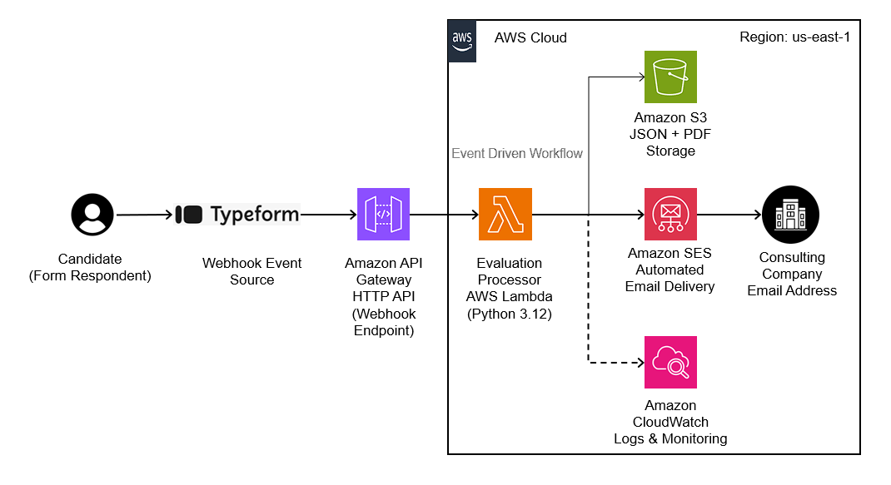

# Serverless Evaluation Pipeline (Typeform + AWS)

Sistema **serverless** para procesar evaluaciones enviadas desde
**Typeform**, generar automáticamente un **reporte PDF**, almacenarlo en
**Amazon S3** y enviarlo por **correo electrónico usando Amazon SES**.

Toda la infraestructura se define como **Infrastructure as Code** usando
**AWS SAM / CloudFormation**.

------------------------------------------------------------------------

# Architecture

El sistema utiliza una arquitectura serverless simple y escalable.

Flujo:

Typeform Webhook\
↓\
API Gateway (POST /evaluacion)\
↓\
AWS Lambda (Python)\
↓\
Generación de PDF (ReportLab)\
↓\
Amazon S3 (almacenamiento de resultados)\
↓\
Amazon SES (envío automático de correo)

Servicios AWS utilizados:

-   AWS Lambda
-   Amazon API Gateway
-   Amazon S3
-   Amazon SES
-   Amazon CloudWatch Logs
-   Lambda Layers
-   AWS SAM / CloudFormation

------------------------------------------------------------------------

# Project Structure

    evaluaciones-serverless/
    │
    ├── lambda/
    │   └── app.py
    │
    ├── layer/
    │   └── dependencies.zip
    │
    ├── template.yaml
    │
    ├── architecture.png
    │
    └── README.md

  Folder             Description
  ------------------ ----------------------------------------------------
  lambda             código de la función Lambda
  layer              dependencias Python empaquetadas como Lambda Layer
  template.yaml      definición de infraestructura serverless
  architecture.png   diagrama de arquitectura
  README.md          documentación del proyecto

------------------------------------------------------------------------

# Requirements

Antes de desplegar el sistema necesitas:

-   Cuenta AWS
-   AWS CLI configurado
-   AWS SAM CLI instalado
-   Python 3.11
-   Bucket S3 existente
-   SES configurado (email o dominio verificado)

Instalar SAM CLI:

    pip install aws-sam-cli

Verificar instalación:

    sam --version

------------------------------------------------------------------------

# Environment Variables

La función Lambda utiliza variables de entorno para evitar **hardcoding
de infraestructura**.

  Variable         Description
  ---------------- ---------------------------------------
  BUCKET_NAME      bucket S3 donde se guardan resultados
  CLIENTE_EMAIL    destinatario del reporte
  FROM_EMAIL       remitente del correo
  SES_REGION       región de SES
  SES_CONFIG_SET   configuration set de SES

Ejemplo:

    BUCKET_NAME=evaluaciones-demo-bucket
    CLIENTE_EMAIL=example@email.com
    FROM_EMAIL=example@email.com
    SES_REGION=us-east-1
    SES_CONFIG_SET=email-debug

------------------------------------------------------------------------

# Quick Start

## 1️⃣ Clonar repositorio

    git clone https://github.com/usuario/evaluaciones-serverless.git
    cd evaluaciones-serverless

------------------------------------------------------------------------

## 2️⃣ Construir el proyecto

    sam build

Esto prepara:

-   código Lambda
-   layer
-   template CloudFormation

------------------------------------------------------------------------

## 3️⃣ Desplegar infraestructura

    sam deploy --guided

Durante el deploy AWS solicitará:

-   nombre del stack
-   región
-   bucket para artefactos
-   confirmación de permisos IAM

SAM creará automáticamente:

-   Lambda
-   API Gateway
-   permisos
-   integración webhook

------------------------------------------------------------------------

# Configure Typeform Webhook

Después del deploy obtendrás un endpoint similar a:

    https://xxxx.execute-api.us-east-1.amazonaws.com/Prod/evaluacion

Configura ese endpoint como **webhook en Typeform**.

Cada envío del formulario activará la Lambda.

------------------------------------------------------------------------

# Output Generated

Cada evaluación produce:

1️⃣ JSON con respuestas procesadas\
2️⃣ PDF con reporte de evaluación

Archivos almacenados en:

    s3://BUCKET_NAME/respuestas/
    s3://BUCKET_NAME/pdfs/

Además el sistema envía automáticamente un **correo con el reporte PDF
adjunto**.

------------------------------------------------------------------------

# Local Testing (Optional)

Puedes probar la Lambda localmente usando Docker:

    sam local invoke -e event.json

------------------------------------------------------------------------

# Cost Considerations

Este proyecto está diseñado para funcionar dentro del **AWS Free Tier**
en entornos de prueba.

Costos principales:

-   Lambda invocations
-   almacenamiento en S3
-   envío de correos en SES

Para cargas pequeñas el costo es **prácticamente cero**.

------------------------------------------------------------------------

# Future Improvements

Posibles mejoras del sistema:

-   usar SQS para desacoplar procesamiento
-   agregar DynamoDB para historial de evaluaciones
-   crear dashboard analítico con Athena o QuickSight
-   usar EventBridge para orquestación
-   implementar autenticación en API Gateway

------------------------------------------------------------------------

# License

Proyecto de ejemplo con fines educativos.
